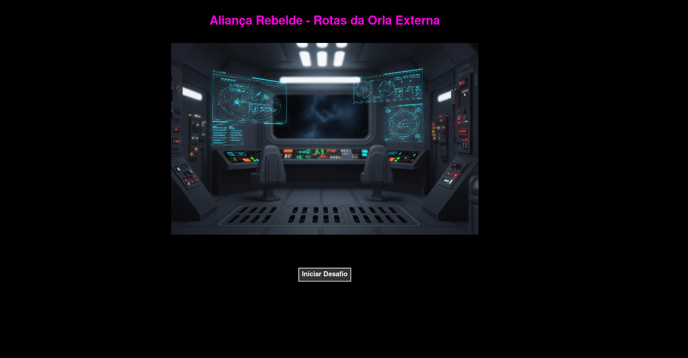

# Star Wars: Aliança Rebelde – Rotas da Orla Externa

<div align="center">
    Figura 1: Aliança Rebelde – Rotas da Orla Externa
    <br>
    
    <br>
    <br>
</div>

**Número da Lista:** 4  
**Conteúdo da Disciplina:** Grafos

## Alunas
| Matrícula | Aluna |
| -- | -- |
| 21/1039573 | Larissa Stéfane Barboza Santos |
| 21/1029497 | Mylena Angélica Silva Farias |
<br>


### Explorar para sobreviver!

**"Aliança Rebelde – Rotas da Orla Externa"** é um jogo de puzzle e simulação em que o jogador assume o papel de **Analista de Rotas da Rebelião**.  
A frota rebelde captou um **sinal de socorro codificado**, perdido entre os sistemas da Orla Externa.  
Para decifrar a origem, você deve percorrer um **grafo espacial** utilizando os algoritmos de **Grafos**, explorando sistemas em ondas e determinando suas distâncias.

A narrativa segue o universo de Star Wars, com uma abordagem lúdica e didática para o ensino de Grafos.

Para compreender melhor sobre o jogo, suas missões e a relação com os algoritmos de grafos, acesse a [Descrição](Descricao.md).


## Inspiração

Este projeto é a continuidade do universo criado pelas estudantes em módulos anteriores da saga **Aliança Rebelde**, que exploram algoritmos de forma narrativa e visual.  
Após lidar com ordenações, buscas e árvores, a Rebelião agora precisa de **eficiência estratégica em suas rotas espaciais**, nas quais grafos são fundamentais para navegação interestelar.

Os repositórios anteriores podem ser acessados nos links abaixo:

**Projeto de algoritmos**

- [Greed – Aliança Rebelde](https://github.com/projeto-de-algoritmos-2025/Greed_Alianca_Rebelde)  
- [Divide and Conquer – Aliança Rebelde 2](https://github.com/projeto-de-algoritmos-2025/DC_Alianca_Rebelde_2)  
- [Programação Dinâmica – Aliança Rebelde: Confronto Final](https://github.com/projeto-de-algoritmos-2025/PD_Alianca_Rebelde_Confronto_Final)

**Estrutura de dados 2**
- [Algoritmos de Busca – Aliança Rebelde](https://github.com/EDAII/Algoritmos_Busca_Alianca_Rebelde)  
- [Algoritmos de Ordenação – Aliança Rebelde](https://github.com/EDAII/Algoritmos_Ordenacao_Alianca_Rebelde)  
<br>
-[Árvores - Aliança Rebelde](https://github.com/EDAII/Arvores_Alianca_Rebelde)

## Estrutura do Projeto

O jogo é dividido em dois conjuntos de missões, localizados em pastas separadas, mas que compartilham o mesmo tema central de **grafos**:

- `JogoGrafos/` → contém as interfaces e minigames das missões  
- `Grafos/` → contém as implementações dos algoritmos (ex.: BFS)  

<br>

## Missões do Jogo (Desafios de Grafos) em JogoGrafos

Localização da pasta: **JogoGrafos**

**Estruturas Focadas:**  
Busca em Largura (BFS)

Cada missão é um minigame projetado para ensinar visualmente os conceitos fundamentais de grafos.

---

### Missão 1: Sinal de Socorro – Busca em Largura (BFS)

**Objetivo:**  
Percorrer um grafo que representa rotas hiperespaciais e descobrir:
- As camadas (níveis) de cada sistema  
- A distância mínima em saltos a partir da base rebelde  
- O sistema responsável pelo sinal de socorro  

**Operações ensinadas:**  
- Uso da **fila** (queue)  
- Marcação de **visitados**  
- Cálculo de **níveis** (distância em arestas)  
- Exploração dos nós vizinhos em ondas  

**Contexto:**  
Um pedido de socorro rebelde foi criptografado.  
A única pista é que o sinal veio de um dos sistemas conectados pelas rotas espaciais.  
Você deve explorar o grafo utilizando BFS para identificar, de forma eficiente, qual planeta enviou o sinal e em quantos saltos ele está.


---

### Missão 2: Estabilidade das Rotas (Grafo Fortemente Conectado)

**Objetivo:** Diagnosticar a estabilidade das rotas e garantir a segurança da frota ao verificar se todos os sistemas são mutuamente alcançáveis (ida e volta).

**Operações ensinadas:** - Criação e uso do **Grafo Reverso**.  
- Execução de **Duas Buscas em Largura (BFS)**: uma no grafo original (G) e outra no grafo reverso.  
- Validação do **Fator de Conectividade** (se 100% dos nós são alcançados nas duas direções).  
- Tomada de **Decisão Estrita** sobre a necessidade de recursos (montar Grafo Reverso) e o veredito final.  

**Contexto:** O Império sabotou os hiper-roteadores ao criar rotas unidirecionais. Assim, a **Frota Rebelde** só está segura se o conjunto de sistemas for **Fortemente Conectado** o que garante que o caminho de VOLTA exista. Sua tarefa é usar o diagnóstico de Duas BFS para confirmar a estabilidade total das rotas.

---

### Missão 3: Infiltração na Base (Busca em Profundidade - DFS)

**Objetivo:** Encontrar um caminho seguro para plantar um explosivo no núcleo da base Imperial ao explorar todos os túneis de ventilação possíveis.

**Operações ensinadas:** - Simulação da **Recursão** (mergulho em profundidade).  
- Visualização do **Backtracking** (Recuo Tático): O retorno da função quando um beco sem saída é atingido.  
- Marcação de **visitados** para evitar loops infinitos.  
- Rastreamento do caminho de infiltração.  

**Contexto:** Você está nos dutos de ventilação da base inimiga. O **DFS** é usado para explorar cada caminho até o fim antes de tentar o próximo. Sua missão é observar o Backtracking e garantir que todas as rotas sejam verificadas para encontrar o caminho seguro e completar a infiltração.


---

### Missão 4: Negociação de Alianças (Grafo Bipartido)

**Objetivo:** Organizar os planetas da Orla Externa em dois grupos de aliança (Rebeldes e Neutros) ao garantir que não haja conflito de interesses.

**Operações ensinadas:** - Conceito de **Coloração** (2-Coloring).  
- Implementação de um algoritmo de busca (BFS) para colorir nós vizinhos com cores opostas.  
- Detecção de **Conflito de Cor** (Vizinhos com a mesma cor) o que indica que o grafo não é Bipartido.  
- Validação da regra: **arestas só podem existir entre grupos de cores diferentes.**

**Contexto:** A Princesa Leia precisa formar uma frente unida. Os planetas só podem se aliar (ligação) se pertencerem a grupos diferentes. Você deve usar a coloração para dividir os planetas em **Grupo Rebelde (Azul)** e **Grupo Neutro (Vermelho)**. Se for detectado um conflito, a aliança é instável e a negociação falha.


---


## Dados Utilizados

Para a simulação, foi utilizado um grafo fixo representando:
- Sistemas estelares (nós)  
- Rotas hiperespaciais (arestas)  
- Conexões usadas pela Rebelião  

Os nós são planetas/estações, e as arestas representam rotas possíveis.  
Esses dados são convertidos para estruturas de lista de adjacência utilizadas no BFS.

<br>

## Link do vídeo

[Assista ao vídeo aqui](LINK)

<br>

## Screenshots

### Intro

<div align="center">
    Figura 2: Introdução do jogo
    <br>
    
    <br><br>
</div>

### Missão 1 – BFS

<div align="center">
    Figura 3: Introdução missão 1
    <br>
    
    <br><br>
</div>

<div align="center">
    Figura 4: Missão 1 concluída
    <br>
    
    <br><br>
</div>


### Missão 2 – Estabilidade das Rotas (Grafo Fortemente Conectado)

<div align="center">
    Figura 5: Missão 2 Intro
    <br>
    
    <br><br>
</div>

<div align="center">
    Figura 6: MIssão 2 - etapa 1
    <br>
    
    <br><br>
</div>

<div align="center">
    Figura 7: Missão 2 - Ajuda
    <br>
    
    <br><br>
</div>

<div align="center">
    Figura 8: Missão 2 - Etapa 2
    <br>
    
    <br><br>
</div>

<div align="center">
    Figura 9: Missão 2 - Grafa reverso 
    <br>
    
    <br><br>
</div>


### Missão 3 – Infiltração na Base (Busca em Profundidade - DFS)

<div align="center">
    Figura 10: Missao 3 - Intro
    <br>
    
    <br><br>
</div>

<div align="center">
    Figura 11: DFS
    <br>
    
    <br><br>
</div>

### Missão 4 – Negociação de Alianças (Grafo Bipartido)

<div align="center">
    Figura 12: Missao 4 - Intro
    <br>
    
    <br><br>
</div>

<div align="center">
    Figura 13: Missao 4 - Bipartido
    <br>
    
    <br><br>
</div>

<div align="center">
    Figura 14: Missao 4 - Dica
    <br>
    
    <br><br>
</div>

---

## Instalação

### 1. Pré-requisitos

Antes de começar, certifique-se de que você tem os seguintes softwares instalados:
* **Python 3:** (versão 3.7 ou superior)  
* **Git:** para clonar o repositório  
* **Tkinter:** para a interface gráfica  
  - **Linux (Debian/Ubuntu):**  
    `sudo apt-get update && sudo apt-get install python3-tk`  
  - **Windows/macOS:** já vem com o Python  

---

### 2. Configuração do Jogo

1. **Clone o Repositório:**

```bash
git clone git@github.com:EDAII/Algoritmos_Grafos_Alianca_Rebelde.git
cd Algoritmos_Grafos_Alianca_Rebelde/JogoGrafos
